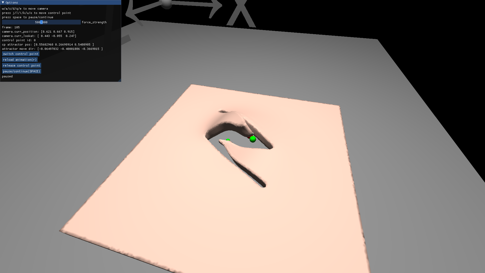
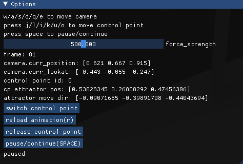

用taichi MPM实现虚拟手术的扭皮(skin twist)

## 1. 简介
本项目使用taichi实现虚拟手术的扭皮效果。方法采用的是MPM lagrangian forces。参考了[meshtaichi](https://github.com/taichi-dev/meshtaichi)中的lag_mpm。

## 2. pre-requisites
- taichi 1.4.0
- trimesh
## 3. 运行
```
python ./lag_mpm/run.py
```
## 4. 效果



## 5. 控制方法



按空格运行，在250帧内会自动加载控制点（绿色）路径动画。250帧后会自动暂停，需要按空格继续。可以使用j/l/i/k/u/o自主控制控制点，使用switch control point来切换控制点。

注意：由于使用的是MPM。因此网格超出计算域（[0,1]的方块）后会终止计算。

- wasdeq：移动视角
- 空格：暂停/继续
- j/l/i/k/u/o：控制扭皮的控制点（绿色点），分别是左右前后上下。
- switch control point：切换控制点(一共有两个绿色的控制点)
- release control point：释放控制点
- reload animation：重新加载动画